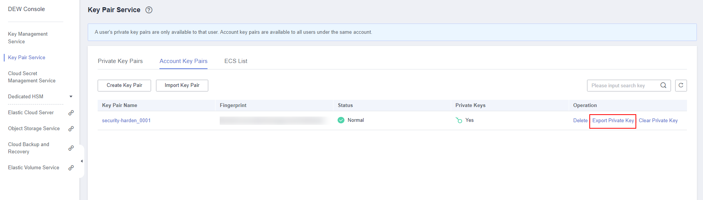

[TOC]

**Solution Overview**
===============
This solution provides SSH hardening for Linux ECSs, helping you secure remote access for Linux servers. It is suitable for scenarios where you need to quickly or batch create Linux ECSs with SSH hardening.

For more details about this solution, visit: https://www.huaweicloud.com/intl/en-us/solution/implementations/sshhlecs.html

**Architecture**
---------------


**Architecture Description**
---------------
This solution will:

1. Create Linux ECSs as required.

2. Assign the same number of EIPs as Linux ECSs and bind them to the ECSs to enable Internet access.

3. Create the same number of key pairs as Linux ECSs and add them to the ECSs for SSH logins with key pairs.

**File Structure**
---------------

``` lua
huaweicloud-solution-security-harden-for-ssh-login-to-linux-ecs
├── security-harden-for-ssh-login-to-linux-ecs.tf.json -- Resource orchestration template
├── userdata
	├──security_hardening.sh -- Script configuration file
```
**Getting Started**
---------------

1. On the [ECS console](https://console-intl.huaweicloud.com/ecm/?agencyId=WOmAijZnbElNjCFzTVDl4aJQAgdaTUMD&region=ap-southeast-3&locale=en-us#/ecs/manager/vmList), view the created ECSs and the EIPs bound to the ECSs.

	Figure 1 Created ECSs

	

2. On the [DEW console](https://console-intl.huaweicloud.com/dew/?region=ap-southeast-3&locale=en-us#/dew/kps/kpsList/ecsList), view the associations between the ECSs and key pairs.

	Figure 2 Associations between ECSs and key pairs

	

3. On the [DEW console](https://console-intl.huaweicloud.com/dew/?region=ap-southeast-3&locale=en-us#/dew/kps/kpsList/accountKey), export the private key associated with the ECS to be logged in to.

	Figure 3 Exporting the private key

	

4. Use Xshell or another SSH client to log in to the ECS with the private key. The default port for SSH login is 5000.

	Figure 4 SSH login to an ECS

	